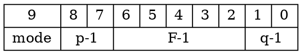

# Lab 3 - Hardware Architecture Design

## Overview

In this lab, we will design an accelerator based on the Eyeriss paper. The goal is to implement the hardware architecture required to efficiently compute the VGG-8 model designed in Lab 1.


This includes key operations such as `2D Convolution` fused with `BatchNorm2D`, `Linear`, `ReLU`, `MaxPool`, and `Post-Quantization`.

We will fuse `BatchNorm2d` into `Conv2D` during the software stage.

For `Conv2D` computation, we will design an Eyeriss-based PE array to support `3×3` convolution operations.

Additionally, we will design a Post Processing Unit to handle `Maxpool`, `ReLU`, and `PostQuant` (We define post-quantization as the process where the quantized values are dequantized, processed, and then requantized, effectively outputting the ofmap).

However, in Lab3, the `linear` operation will not be implemented.

Students can try to think about how to fine-tune the Eyeriss architecture so that the PE array can also support linear operations. This contribution could serve as a breakthrough for the final project.


## Eyeriss

In Lab 3, we will design our accelerator based on the Eyeriss paper.
You can [download the paper](https://moodle.ncku.edu.tw/pluginfile.php/1801205/mod_assign/introattachment/0/Eyeriss.pdf?forcedownload=1) through Moodle.

## Post Processing Unit

Besides `Conv2D` fused with `BatchNorm2D` and `linear` operations,
we still need to calculate `ReLU` and `MaxPool` operations.


We also need to perform post-quantized
- Dequantize and requantize the activations
- Dequantize the weight

### Quantization

#### Quantization Method

In order to simplify the hardware implementation, we use **layerwise symmetric uniform quantization** for all layers in Lab 1.
> Refer to Lab1 HackMD for more details if unfamiliar with this quantization method.

Here are the data types for inputs, weights, biases, outputs, and partial sums:

|           | input/output activation | weight | bias/psum |
|:---------:|:------------:|:------:|:---------:|
| Data type |    uint8     |  int8  |   int32   |


Note that:
1.  The scaling factor of bias is the product of input's scale and weight's scale.
2.  The rounding method is truncation instead of round-to-nearest.

#### Quantization

$$
\tag{1}
\begin{align}
\bar x &= \text{clamp} \left( \left\lfloor \frac{x}{s_x} \right\rceil + 128, 0, 255 \right) \in \mathbb{Z}_\text{uint8}^{\dim(x)} \\
\bar w &= \text{clamp} \left( \left\lfloor \frac{w}{s_w} \right\rceil, -128, 127 \right) \in \mathbb{Z}_\text{int8}^{\dim(w)} \\
\bar b &= \text{clamp} \left( \left\lfloor \frac{b}{s_x s_w} \right\rfloor, -2^{31}, 2^{31}-1 \right) \in \mathbb{Z}_\text{int32}^{\dim(b)} \\
\bar y &= \text{clamp} \left( \left\lfloor \frac{y}{s_y} \right\rceil + 128, 0, 255 \right) \in \mathbb{Z}_\text{uint8}^{\dim(y)}
\end{align}
$$

> The notation $\mathbb{Z}^N$ denotes a vector space of dimension $N$
where all elements (or components) are integers. See also [Cartesian product](https://en.wikipedia.org/wiki/Cartesian_product).

where the scaling factors are calaulated by

$$
\tag{2}
\begin{align}
s_x = \frac{2 \max(|x_\min|, |x_\max|)|}{255} \in \mathbb{R}_\text{float32} \\
s_w = \frac{2 \max(|w_\min|, |w_\max|)|}{255} \in \mathbb{R}_\text{float32} \\
s_y = \frac{2 \max(|y_\min|, |y_\max|)}{255} \in \mathbb{R}_\text{float32}
\end{align}
$$

#### Dequantization

The original values can be approximated by dequantizing the quantized numbers.

$$
\tag{3}
\begin{align}
x &\approx s_x (\bar x - 128) \\
w &\approx s_w \bar w \\
b &\approx s_x s_w \bar b \\
y &\approx s_y (\bar y - 128)
\end{align}
$$

#### Quantized Computation Operations

Quantized computation operations require **dequantization** of inputs to a higher-precision representation before performing arithmetic computations. Once the operations are completed, the results are **requantized** to restore them to the quantized format, ensuring that the output remains compatible as the input for the next layer, allowing seamless execution of subsequent computations.

To enable hardware to perform computations directly on quantized bits, we ==factor out the scaling factor== using the following mathematical transformation. This yields an equivalent expression where the scaling factor can be uniformly applied during post-processing, allowing computations to be carried out in `int8` format.

##### Quantized Scalar Multiplication

With $\dim(x) = \dim(w) = \dim(y) = 1$ in Eq. 1, multiplication between two quantized numbers are:

$$
y = x \cdot w
$$

$$
s_y (\bar y - 128) = s_x (\bar x - 128) \cdot s_w \bar w
$$

$$
\bar y = \text{clanmp} \left( \frac{s_x s_w}{s_y} (\bar x - 128) \bar w + 128 , 0, 255\right)
$$

##### Quantized Matrix Multiplication

$$
y_i = b_i + \sum_j x_j \cdot w_{ji}
$$

can be approximated as the following using Eq. 3

$$
\begin{align}
s_y (\bar y_i - 128) &= s_x s_w \bar b_i + \sum_j s_x (\bar x_j - 128) \cdot s_w \bar w_{ji} \\
&= s_x s_w (\bar b_i + \sum_j (\bar x_j - 128) \cdot \bar w_{ji})
\end{align}
$$

then we get

$$
\tag{4}
\bar y_i = \text{clamp} \left( \frac{s_x s_w}{s_y} (\bar b_i + \sum_j (\bar x_j - 128) \cdot \bar w_{ji}) + 128, 0, 255 \right)
$$

##### Quantized Linear Layer


$$
y_i = b_i + \sum_j x_j \cdot w_{ji}
$$

$$
s_y (\bar y_i - 128) = s_x s_w (\bar b_i + \sum_j (\bar x_j - 128) \cdot \bar w_{ji})
$$

$$
\tag{5}
\bar y_i = \text{clamp} \left(
\underbrace{
    \frac{s_x s_w}{s_y}
    \overbrace{
        (\bar b_i + \sum_j (\bar x_j - 128) \cdot \bar w_{ji})
    }^{\text{only int32 operations}}}_{\text{float32 operations involved}
} + 128, 0, 255 \right)
$$


##### Quantized Convolution Layer

$$
y_{m,~e,~f} = b_{m} + \sum_c \sum_r \sum_s x_{c,~Ue+r,~Uf+s} \cdot w_{m,~c,~r,~s}^T
$$

$$
\tag{6}
\bar y_{m,~e,~f} = \text{clamp} \left(
\underbrace{
    \frac{s_x s_w}{s_y}
    \overbrace{
        (\bar b_m + \sum_{c,~r,~s} (\bar x_{c,~Ue+r,~Uf+s} - 128) \cdot \bar w_{m,~c,~r,~s}^T)
    }^{\text{only int32 operations}}}_{\text{float32 operations involved}
} + 128 , 0, 255\right)
$$

#### Hardware-Friendly Quantization Design

##### Power-of-Two Approximation for Scaling Factors

We use dyadic quantization method in Lab1, so that we get the scaling factor:

$$
s \approx \frac{b}{2^c} \text{ , where } b, c \in \mathbb{Z}
$$

With $b = 1$ in dyadic quantization, we further get power-of-two quantization:

$$
s \approx \frac{1}{2^c} = 2^{-c} \text{ , where } c \in \mathbb{Z}
$$

The quantized convolution operation can be approximated as:

$$
\tag{7}
\bar y_{m,~e,~f} = \left(
    (\bar b_m + \sum_{c,~r,~s} (\bar x_{c,~Ue+r,~Uf+s} - 128) \cdot \bar w_{m,~c,~r,~s}^T)
        \gg \frac{s_x s_w}{s_y} \right) + 128
$$

##### Efficient Handling for Zero Points
$$
128 = 1000\_0000_2
$$

Adding or subtracting 128 is equivalent to toggling the most significant bit (MSB) of an 8-bit unsigned integer, which can also be achieved by XORing 128 with that integer.

$$
\begin{align}
\bar x_j - 128 &= \bar x_j \oplus 128 = \{\sim \bar x[7],\ \bar x[6:0]\} \\
\bar y_j + 128 &= \bar y_j \oplus 128 = \{\sim \bar y[7],\ \bar y[6:0]\}
\end{align}
$$

$$
\text{where} \oplus \text{is the bitwise XOR operation.}
$$

The matrix multiplication can be further expressed as:

$$
\tag{8}
\bar y_{m,~e,~f} = \text{clanmp} \left[ \left( \left(
    (\bar b_m + \sum_{c,~r,~s} (\bar x_{c,~Ue+r,~Uf+s} \oplus 128) \cdot \bar w_{m,~c,~r,~s}^T)
        \gg \frac{s_x s_w}{s_y} \right) \oplus 128 \right) ,0 , 255\right]
$$

### ReLU

ReLU is an abbreviation for Rectified Linear Unit.
$$
\operatorname{ReLU} = \max(0, x)
$$

ReLU is the most commonly used **nonlinear activation function** in CNNs due to its computational efficiency, ability to mitigate the vanishing gradient problem, and promotion of sparsity in network activations.

Unlike sigmoid<sup>[1]</sup>  or tanh<sup>[2]</sup>, ReLU involves only a simple thresholding operation, significantly reducing computational complexity. Its non-saturating property enables effective gradient propagation in deep networks, facilitating faster convergence. Additionally, ReLU induces sparsity by setting negative activations to zero, enhancing feature selectivity and regularization.
See [ReLU's wikipedia](https://zh.wikipedia.org/zh-tw/%E7%BA%BF%E6%80%A7%E6%95%B4%E6%B5%81%E5%87%BD%E6%95%B0) for more details.

#### Note

#### [1] sigmoid function
It is a smooth, S-shaped function that maps any real-valued input to the range $(0,1)$.
The sigmoid function is particularly useful for probabilistic interpretations, as its output can be interpreted as a probability. It remains widely used in binary classification tasks and as a gating function in architectures such as LSTMs.
$$
\sigma = \frac{1}{1+e^{-x}}
$$

##### [2] tanh function
The hyperbolic tangent function `tanh` is a smooth, S-shaped function that maps any real-valued input to the range  $(−1,1)$.
The function is odd-symmetric $tanh(−x)=−tanh(x)$ and exhibits asymptotic behavior, approaching -1 as $x \rightarrow -\infty$ and 1 as $x \rightarrow \infty$. Unlike the sigmoid function, `tanh(x)` is **zero-centered**, meaning that its output is centered around 0, which often facilitates faster convergence in deep learning applications.
Due to its saturating properties,  `tanh(x)` is prone to vanishing gradient issues when used in deep networks. Nevertheless, it remains widely employed in neural networks, particularly in recurrent architectures such as LSTMs and GRUs, where it serves as an activation function in hidden state updates.
$$
\tanh(x) = \frac{e^x - e^{-x}}{e^x + e^{-x}}
$$

### MaxPool

Max pooling is a widely used downsampling operation in CNNs
that reduces spatial dimensions while retaining the most salient features. It is defined as:

$$
y_{i,j} = \max_{(m,n) \in R_{i,j}} x_{m,n}
$$

where $R_{i,j}$ represents the receptive field (e.g., a $k\times k$ region), and $x_{m,n}$ are the input values within this region. Max pooling preserves the strongest activations by selecting the maximum value in each window, enhancing translational invariance and improving computational efficiency. It is commonly applied with a $2 \times 2$ window and a stride of 2, reducing feature map size while mitigating overfitting. However, it may discard finer details, making it less suitable for tasks requiring precise spatial information.

for example:

$$
X =
\begin{bmatrix}
1 & 3 & 2 & 1 \\
4 & 8 & 6 & 2 \\
3 & 5 & 7 & 9 \\
2 & 4 & 6 & 8 \\
\end{bmatrix}
$$

Resulting pooled output:

$$
Y =
\begin{bmatrix}
8 & 6 \\
5 & 9 \\
\end{bmatrix}
$$

## Hardware Architecture


### Controller
The Controller in Eyeriss acts as the central unit that orchestrates the entire execution process. It ensures that different modules operate in a synchronized manner and that the correct data is processed at the right time. The key responsibilities of the Controller include:

#### Logic Control
Managing the overall execution sequence of the hardware.

#### Module Activation
Deciding when each module, such as the Processing Element (PE) Array and Post-Processing Unit (PPU), should start execution.

#### Data Routing
Controlling the movement of data between memory, processing elements, and post-processing units.

Assigning Tag IDs to allow data to be multicast to multiple designated PEs, ensuring that shared data is efficiently distributed across the array.

#### GLB Data Management
- Determining which data should be swapped in and out of GLB.
- Ensuring efficient data reuse by preloading required feature maps, weights, and intermediate results.
- Managing data transfer between external DRAM and GLB, optimizing memory bandwidth utilization.

### GLB Memory Usage Calculation
Calculation Order: NCHW

$$
\text{ifmap usage} = 1 * (q * r) * (e + R - 1) * (F + S - 1) * \text{1 byte}
$$

$$
\text{filter usage} = (p * t) * (q * r) * R * S* \text{1 byte}
$$

$$
\text{bias usage} = (p * t) * \text{4 byte}
$$

$$
\text{opsum usage} = 1 * m * e * F
$$

$$
\text{GLB total size} = 64 \text{ KiB}
$$

$$
\tag{9}
\text{GLB total size} \le \text{ifmap usage} + \text{filter usage} + \text{bias usage} + \text{opsum usage}
$$

Among these parameters, `p, q, r, t, e, R, S, F, GLB total size` are constants, allowing `m` to be calculated using Equation (9).

### AXI Protocol

#### MMIO (Memory-Mapped I/O)

Memory-Mapped I/O (MMIO) is a common mechanism in ASIC and embedded system design that allows peripherals to be accessed using standard memory read and write instructions.

In MMIO, **peripheral registers are mapped to specific memory addresses**, enabling the CPU to interact with devices such as DMA controllers, AI accelerators, and communication interfaces through load/store operations instead of special I/O instructions.

This approach simplifies hardware design, improves data transfer efficiency. MMIO transactions are typically non-cacheable to ensure real-time data consistency, and memory barriers may be required to enforce execution order. This method is widely used in high-performance SoC architectures, where CPUs configure peripherals by writing to control registers, while peripherals report status and events through MMIO reads.

##### Memory-Mapped I/O v.s Port-Mapped I/O


| Feature       | MMIO                                        | PMIO                              |
| ------------- | ------------------------------------------- | --------------------------------- |
| Access Method | Uses standard load/store instructions       | Uses dedicated I/O instructions   |
| Address Space | Shares the same memory address space as RAM | Uses a separate I/O address space |
| Performance   | Faster                                      | Slower                            |
| Use Cases     | DMA, AI Accelerator, GPU                    | UART                              |

#### AXI Protocol

##### Introduction

The AXI (Advanced eXtensible Interface) Protocol is a high-performance communication protocol within ARM's AMBA (Advanced Microcontroller Bus Architecture), widely used in SoC (System on Chip) designs to facilitate efficient data transfer between processors, memory controllers, and peripherals.

##### Five Independent Channels

AXI operates with five independent channels enabling simultaneous read and write transactions for improved performance.
- AR (Address Read)
- R (Read Data)
- AW (Address Write)
- W (Write Data)
- and B (Write Response)

##### Brust Mode

The protocol supports burst-based transactions, allowing multiple data transfers per request, and offers three burst types: Fixed, Incrementing, and Wrapping, optimizing memory access efficiency. Key features include support for unaligned data transfers, separate read/write channels, and optional out-of-order execution.

##### Ready-Valid Handshake

The protocol uses handshake signals (VALID and READY) to synchronize data flow, ensuring reliable communication.

##### Conclusion

AXI is highly scalable, supporting data widths from 32-bit to 512-bit, making it ideal for processor-memory interactions, DMA transfers, AI accelerators, GPUs, and FPGA designs. Its low-latency, high-throughput, and flexible nature makes it a preferred choice in modern embedded and high-performance computing systems.

### DMA (Direct Memory Access)

In ASIC design, the DMA directly writes data to the GLB (Global Buffer), providing efficient and low-latency memory access to optimize the data flow for local computation resources.

This architecture is commonly used in AI accelerators, image processors, and deep learning inference engines, ensuring that compute units can stably retrieve data and enhance computational efficiency.

The DMA controller supports high-throughput data transfer and accelerates data movement using AXI Burst Mode.

Additionally, since the data is quantized to 8-bit, a specialized memory ordering is required when storing data in the GLB. Therefore, the DMA supports two modes for handling 8-bit and 32-bit data transfers separately.

For more details, see the [Wikipedia](https://zh.wikipedia.org/zh-tw/直接記憶體存取)

## Practice

### Data Transfer by Handshake

#### What is Handshake?
A handshake is a fundamental mechanism used in digital communication to ensure reliable data transfer between two parties. It establishes synchronization between the sender and receiver, ensuring that data is transmitted only when both sides are ready. Handshaking protocols are widely used in computer networks, peripheral interfaces, and bus protocols such as `AXI`, `SPI`, and `I²C`.

In a typical handshake, control signals are exchanged between the sender and receiver before actual data transmission. This prevents data loss, ensures flow control, and optimizes system efficiency.

#### Ready-Valid Handshake (Common in AXI Protocols):


- A widely used mechanism in hardware interfaces where the sender asserts a valid signal when data is available, and the receiver asserts a ready signal when it is ready to consume the data.
- The transaction is completed when both valid and ready signals are asserted simultaneously.
- In this lab, we use this for our handshake mechanism
- For more details, please visit [this website](https://vhdlwhiz.com/how-the-axi-style-ready-valid-handshake-works/).


### Eyeriss PE Array

!!! tip
    You have to use `generate` block to generate PE, X-Bus, Y-Bus, MC.

These are the shape parameters and mapping parameters defined by Eyeriss. They will be used directly in the following sections, so students must familiarize themselves with them to better understand the document.

**Shape Parameter**

| Parameter | Description                           |
|:---------:| ------------------------------------- |
|     N     | batch size of 3D fmaps                |
|     M     | # of 3D filters / # of ofmap channels |
|     C     | # of ifmap/filter channels            |
|    H/W    | ifmap plane height/width              |
|    R/S    | filter plane height/width             |
|    E/F    | ofmap plane height/width              |

**Mapping Parameter**

| Parameter | Description                                                       |
|:---------:| ----------------------------------------------------------------- |
|     m     | number of ofmap channels stored in the GLB                        |
|     n     | number of ifmaps used in a processing pass                        |
|     e     | width fo the PE set                                               |
|     p     | number of filters processed by a PE set                           |
|     q     | number of channels processed by a PE set                          |
|     r     | number of PE sets that process different channels in the PE array |
|     t     | number of PE sets that process different filters in the PE array  |

#### Testbench Guildline

- The testbench for this lab is written using **Verilator**.
  For a detailed tutorial on Verilator, please refer to the **Lab 0.4 HackMD** handout.

- This testbench requires two additional files:
  - **define.svh** `./include/define.svh`
    This file contains **macro definitions** and is included during Verilator compilation, making the defined macros directly accessible.
    If you need to add more macro definitions, you can modify this file accordingly.

  - **config.h** `./testbench/config_*.h`
    This file stores information about each test case, including test parameters and data locations, allowing the testbench to read the necessary data and perform complete computations.

- After running the simulation, you can obtain the waveform file at the following path `/wave/*.vcd` .
    > Refer to the Lab 0.4 Verilator Tutorial for instructions on how to open and inspect the waveform file to verify your design.

#### PE

##### Load Ifmap

When loading the ifmap, you must first subtract the zero-point.
Since we use uint8 symmetric quantization, the zero-point is 128
For details, refer to the [Lab1 HackMD handout](https://hackmd.io/@yutingshih/aoc2025/%2Fq9JuAj-qRtCdLSsErp0NFg#SymmetricAsymmetric).

**You should adopt a more hardware-friendly approach to replace this subtraction**.
**Otherwise, points may be deducted accordingly.**

##### Activation of PE

The PE computes a 1-D convolution primitive. The PE waits for the testbench to assert `PE_en`. Once `PE_en` is high, `PE_config` becomes valid, and the PE reads its contents to determine the information for the current 1-D convolution computation. Afterward, the testbench starts sending and retrieving data through a handshake mechanism. The process continues until the computation is complete.

The following is the definition of `PE_config`

`mode = 0` means `CONV`
`mode = 1` means `FC Layer`


##### I/O ports

```verilog
module PE (
    input clk,
    input rst,
    input PE_en,
    input [`CONFIG_SIZE-1:0] i_config,
    input [`DATA_BITS-1:0] ifmap,
    input [`DATA_BITS-1:0] filter,
    input [`DATA_BITS-1:0] ipsum,
    input ifmap_valid,
    input filter_valid,
    input ipsum_valid,
    input opsum_ready,
    output logic [`DATA_BITS-1:0] opsum,
    output logic ifmap_ready,
    output logic filter_ready,
    output logic ipsum_ready,
    output logic opsum_valid
);
```

##### Testbench Behavior

If a 1-D convolution needs to be computed as shown below:




#### PE Array

##### I/O ports

```verilog
module PE_array #(
    parameter NUMS_PE_ROW = `NUMS_PE_ROW,
    parameter NUMS_PE_COL = `NUMS_PE_COL,
    parameter XID_BITS = `XID_BITS,
    parameter YID_BITS = `YID_BITS,
    parameter DATA_SIZE = `DATA_BITS,
    parameter CONFIG_SIZE = `CONFIG_SIZE
)(
    input clk,
    input rst,

    /* Scan Chain */
    input set_XID,
    input [`XID_BITS-1:0] ifmap_XID_scan_in,
    input [`XID_BITS-1:0] filter_XID_scan_in,
    input [`XID_BITS-1:0] ipsum_XID_scan_in,
    input [`XID_BITS-1:0] opsum_XID_scan_in,
    // output [XID_BITS-1:0] XID_scan_out,

    input set_YID,
    input [`YID_BITS-1:0] ifmap_YID_scan_in,
    input [`YID_BITS-1:0] filter_YID_scan_in,
    input [`YID_BITS-1:0] ipsum_YID_scan_in,
    input [`YID_BITS-1:0] opsum_YID_scan_in,
    // output logic [YID_BITS-1:0] YID_scan_out,

    input set_LN,
    input [`NUMS_PE_ROW-2:0] LN_config_in,

    /* Controller */
    input [`NUMS_PE_ROW*`NUMS_PE_COL-1:0] PE_en,
    input [`CONFIG_SIZE-1:0] PE_config,
    input [`XID_BITS-1:0] ifmap_tag_X,
    input [`YID_BITS-1:0] ifmap_tag_Y,
    input [`XID_BITS-1:0] filter_tag_X,
    input [`YID_BITS-1:0] filter_tag_Y,
    input [`XID_BITS-1:0] ipsum_tag_X,
    input [`YID_BITS-1:0] ipsum_tag_Y,
    input [`XID_BITS-1:0] opsum_tag_X,
    input [`YID_BITS-1:0] opsum_tag_Y,

    /* GLB */
    input GLB_ifmap_valid,
    output logic GLB_ifmap_ready,
    input GLB_filter_valid,
    output logic GLB_filter_ready,
    input GLB_ipsum_valid,
    output logic GLB_ipsum_ready,
    input [DATA_SIZE-1:0] GLB_data_in,

    output logic GLB_opsum_valid,
    input GLB_opsum_ready,
    output logic [DATA_SIZE-1:0] GLB_data_out

);
```

##### Insturction

```
make pe%
```

##### Testbench Behavior

If a 2-D convolution needs to be computed as shown below:



In addtion to PE array, you need to implement the following submodules to construct it.

#### GIN/GON


##### I/O ports

``` verilog
module GIN (
    input clk,
    input rst,

    // Slave SRAM <-> GIN
    input GIN_valid,
    output logic GIN_ready,
    input [`DATA_BITS - 1:0] GIN_data,

    /* Controller <-> GIN */
    input [`XID_BITS - 1:0] tag_X,
    input [`YID_BITS - 1:0] tag_Y,

    /* config */
    input set_XID,
    input [`XID_BITS - 1:0] XID_scan_in,
    input set_YID,
    input [`YID_BITS - 1:0] YID_scan_in,

    // Master GIN <-> PE
    input [`NUMS_PE_ROW * `NUMS_PE_COL - 1:0] PE_ready,
    output logic [`NUMS_PE_ROW * `NUMS_PE_COL - 1:0] PE_valid,
    output logic [`DATA_BITS - 1:0] PE_data
);
```

#### Bus

##### I/O ports
``` verilog
 module GIN_Bus #(
    parameter NUMS_SLAVE = `NUMS_PE_COL,
    parameter ID_SIZE = `XID_BITS
) (
    input clk,
    input rst,

   // Master I/O
    input [ID_SIZE-1:0] tag,
    input master_valid,
    input [`DATA_BITS-1:0] master_data,
    output logic master_ready,

   // Slave I/O
    input [NUMS_SLAVE-1:0] slave_ready,
    output logic [NUMS_SLAVE-1:0] slave_valid,
    output logic [`DATA_BITS-1:0] slave_data,

    // Config
    input set_id,
    input [ID_SIZE-1:0] ID_scan_in,
    output logic [ID_SIZE-1:0] ID_scan_out
 );
```

#### Multicast Controller

##### I/O ports

```verilog
module GIN_MulticastController #(
    parameter ID_SIZE = `XID_BITS
    )(
    input clk,
    input rst,

    input set_id,
    input [ID_SIZE - 1:0] id_in,
    output reg [ID_SIZE - 1:0] id,

    input [ID_SIZE - 1:0] tag,

    input valid_in,
    output logic valid_out,
    input ready_in,
    output logic ready_out
);
```

#### Testbench Behavior
The following slides illustrate how the testbench sends the config ID to the bus.



#### Instruction

There are six testbenches for different mapping parameter.


| para | array0 | array1 | array2 | array3 | array4 | array5 |
|:----:|:------:|:------:|:------:|:------:|:------:|:------:|
|  F   |   16   |   32   |   16   |   16   |   16   |   16   |
|  e   |   8    |   8    |   8    |   4    |   4    |   16   |
|  p   |   4    |   4    |   4    |   4    |   4    |   4    |
|  q   |   4    |   3    |   4    |   4    |   4    |   4    |
|  r   |   1    |   1    |   2    |   2    |   1    |   1    |
|  t   |   2    |   2    |   1    |   2    |   4    |   1    |

```
make array%
```

### Post Processing Unit

In the post-processing unit (PPU), you must implement three operations: `PostQuant`, `ReLU`, and `MaxPool`. Whether `MaxPool` needs to be computed depends on `maxpool_en`.

You can think of the PPU as an always-on module.

#### PostQuant

##### Scaling Factor

Based on the result calculated in (8), we know that Quantized Convolution can be equivalently expressed by this equation.

If $\frac{s_x \times s_w}{sy} = 2^n$ the testbench will send the integer value `n` to the module.

##### Zero Point

Opposite to the PE operation, when requantizing to uint8, you need to add the zero-point.

Similarly, you cannot use an adder for this operation; instead, you must adopt a more hardware-friendly approach.

**Otherwise, points may be deducted accordingly.**

##### Clamping


In post-quantization, after scaling and zero-point adjustment, the output values may exceed the valid range for`uint8` (i.e., `0` to `255`). Therefore, clamping is necessary to ensure that the final output remains within the acceptable range.

$$
x = \text{clamp} \left( x, 0, 255 \right)
$$

To implement hardware-friendly clamping, we **avoid using explicit comparators or conditional branches**, as they introduce extra logic and may increase latency. Instead, we leverage **bitwise operation** that are more suitable for synthesis in hardware.


#### Maxpool

- MaxPool is required
the testbench will provide the first data sample when maxpool_init is asserted, followed by three additional data samples in consecutive cycles. The testbench will then read the output data in the next cycle.
- MaxPool is not required
the testbench will read the output data in the cycle following the data input.


#### I/O ports
```verilog
module PPU (
    input clk,
    input rst,
    input [`DATA_BITS-1:0] data_in,
    input [5:0] scaling_factor,
    input maxpool_en,
    input maxpool_init,
    input relu_sel,
    input relu_en,
    output logic[7:0] data_out
);
```
> `relu_sel` select whether to output the data from `post_quant` or `from max_pool`
> `*_en`  indicates whether the submodule is enabled.

#### Instruction

There are three testbenches.

```
make ppu%
```
