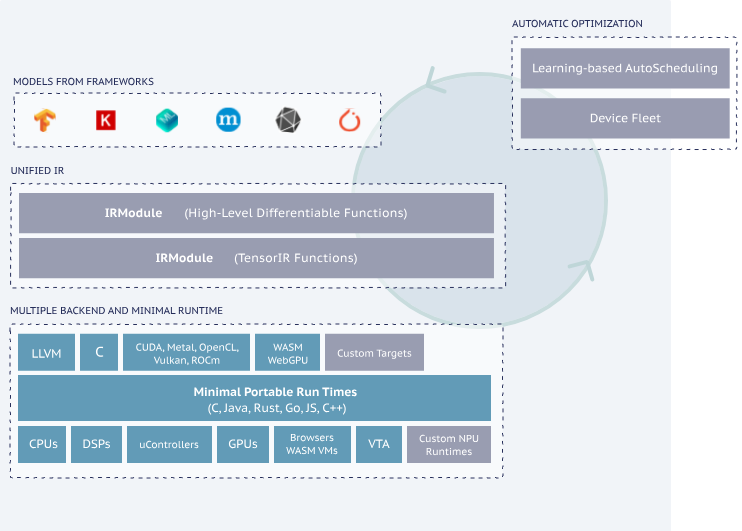
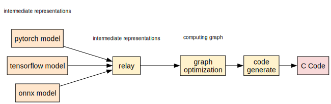
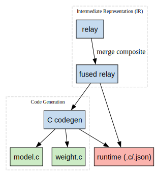
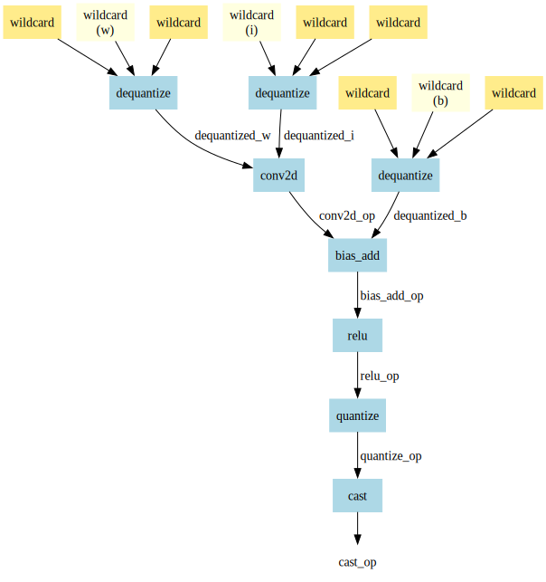
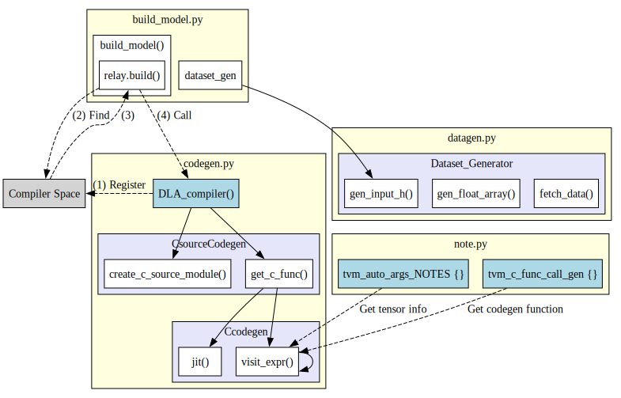
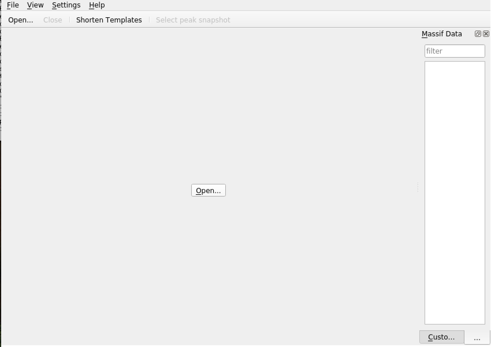
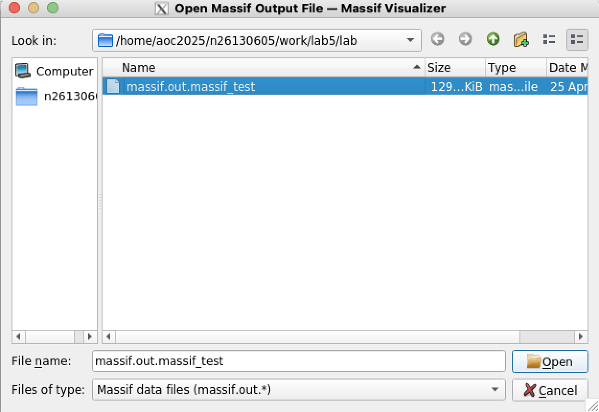
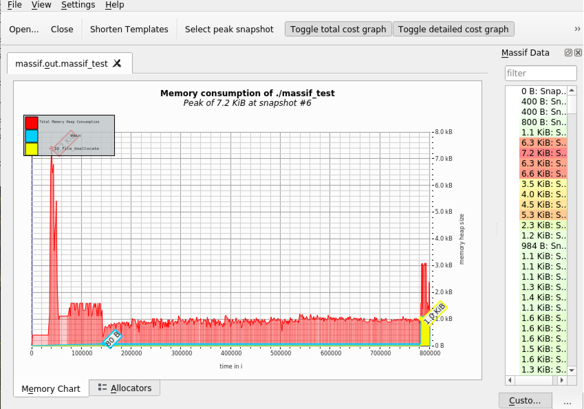
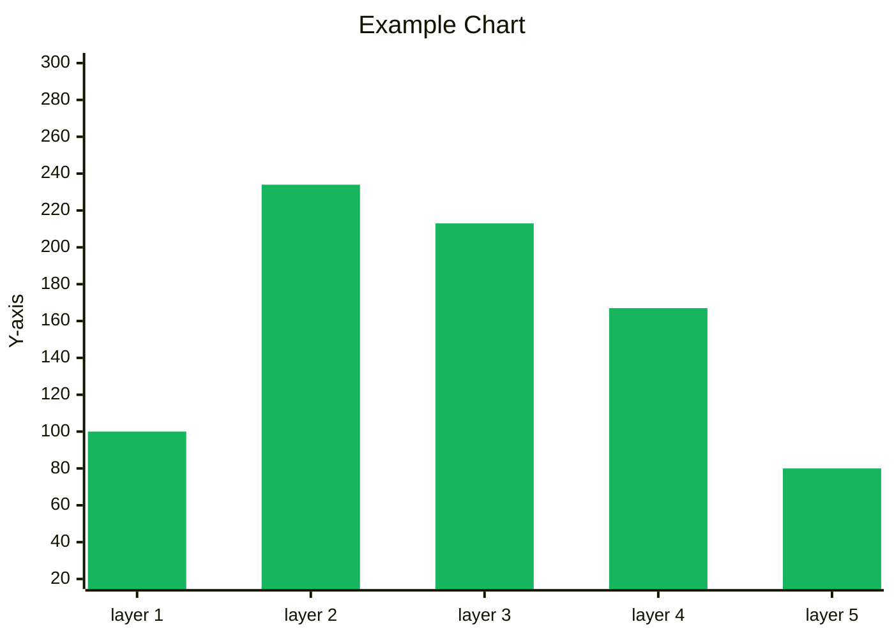

# Lab 5 - AI Compiler

## Overview

In this lab, we will implement an AI compiler flow that bridges high-level machine learning models with low-level C code deployment, targeting CPU execution. By integrating TVM, a machine learning compiler framework, with a code generator and pattern fusion engine, we create an end-to-end system capable of compiling models like PyTorch into optimized C code. The compiler serves as a crucial translation and optimization layer, converting models from intermediate representations (Relay) into fused, low-level operator sequences suitable for embedded or resource-constrained environments.

The code generation runtime, which controls this compilation pipeline, leverages modular passes such as operator fusion, pattern recognition, and C function call generation to produce executable code that mimics real hardware accelerator deployment. This abstraction allows us to study inference performance and correctness in a software-only context, simulating hardware-constrained environments.

Moreover, the lab guides us through implementing key components such as Relay operator fusion, model traversal, and shape-aware codegen logic. Through these implementations, we investigate how compiler-level optimizations—like operator fusion and quantization-aware generation—impact inference performance and portability. Ultimately, this lab equips us with practical insights into how AI compilers serve as a critical infrastructure in deploying deep learning models across heterogeneous platforms.

## Lab 5.0 - Enviroment Setup

In the upcoming assignment, TVM will be required. Please follow the instructions below to set up the environment.

Set up the basic environment and download the required configurations.

```bash
conda create -n tvm-lab
conda activate tvm-lab
conda install python=3.11
conda install llvmdev=18 -c conda-forge
```
>[!Warning]
>If you encounter an issue where Conda is not found, it means Conda has not been installed. The installation guide for Miniconda can be found in Lab 0.


We need the **CPU version** of `torchvision`, and the TVM version is already installed on the server. Please use the following command to install it to your local conda environment.

```bash
pip3 install torch torchvision --index-url https://download.pytorch.org/whl/cpu
pip3 install onnx
pip3 install graphviz
pip3 install -e /opt/tvm/python
```

After completing the above steps, extract the files from Moodle and place them on the server.

## Lab 5.1 - Introduction to AI Compiler

AI compilers enable the deployment of models from high-level frameworks like TensorFlow and PyTorch onto various hardware platforms such as CPUs, GPUs, and AI accelerators by transforming high-level code into low-level executable code.

### TVM

One such compiler is [TVM](https://tvm.apache.org/), an open-source machine learning compiler framework designed to optimize and deploy deep learning models efficiently across diverse hardware targets. TVM automates the process of translating models into optimized code tailored to specific hardware architectures.



### Bring Your Own Codegen (BYOC)
The compilation process begins by converting models from TensorFlow or PyTorch into an Intermediate Representation (IR). In the high-level IR, computations are structured as a computation graph, where each node represents an operation (e.g., matrix multiplication, convolution). This graph is then progressively optimized through multiple stages. Finally, TVM’s code generation (codegen) module translates the optimized IR into low-level C code or other backend-specific code for execution on the target hardware.

For more information about BYOC, see [How to Bring Your Own Codegen to TVM](https://tvm.apache.org/2020/07/15/how-to-bring-your-own-codegen-to-tvm)

<!--digraph compiler_flow {
    rankdir=LR;
    node [shape=box style=filled fontname="Arial"];

    pytorchinput [label="pytorch model", fillcolor="#ffe6cc"];
    tensorflowinput [label="tensorflow model", fillcolor="#ffe6cc"];
    onnxinput [label="onnx model", fillcolor="#ffe6cc"];

    relay [label="relay", fillcolor="#fff2cc"];
    optimization [label="graph\noptimization", fillcolor="#fff2cc"];
    codegen [label="code\ngenerate", fillcolor="#fff2cc"];
    ccode [label="C Code", fillcolor="#f8d9d9"];


    tensorflowinput -> relay;
    onnxinput -> relay;
    pytorchinput -> relay -> optimization -> codegen -> ccode;

    // Virtual label node for intermediate representations
    model_label [label="intermediate representations", fillcolor="#ffffff",shape=none, fontsize=10];
    { rank=same; model_label; pytorchinput; tensorflowinput; onnxinput;}

    // Virtual label node for intermediate representations
    ir_label [label="intermediate representations", fillcolor="#ffffff",shape=none, fontsize=10];
    { rank=same; ir_label; relay;}

    // Virtual label node for computing graph
    cg_label [label="computing graph",fillcolor="#ffffff", shape=none, fontsize=10];
    { rank=same; cg_label; optimization }
}-->




!!! question "Question: What will Relay look like?"

    After being converted by TVM, the high-level Relay representation will look like this.

    ```
    def @main(%input: Tensor[(1, 3, 32, 32), float32] /* ty=Tensor[(1, 3, 32, 32), float32] span=/quant/QuantizeLinear.input:0:0 */) -> Tensor[(1, 10), float32] {
      %0 = qnn.quantize(%input, 0.015625f /* ty=float32 span=/quant/Constant_1:0:0 */, 128 /* ty=int32 span=/quant/QuantizeLinear:0:0 */, out_dtype="uint8", axis=1) >/* ty=Tensor[(1, 3, 32, 32), uint8] span=/quant/QuantizeLinear:0:0 */;
      %1 = cast(%0, dtype="uint8") /* ty=Tensor[(1, 3, 32, 32), uint8] span=/module/conv1/0/Cast:0:0 */;
      %2 = qnn.dequantize(%1, 0.015625f /* ty=float32 span=/module/conv1/0/Constant:0:0 */, 128 /* ty=int32 span=/module/conv1/0/DequantizeLinear:0:0 */, out_dtype="float32", axis=1) /* ty=Tensor[(1, 3, 32, 32), float32] span=/module/conv1/0/DequantizeLinear:0:0 */;
      %3 = qnn.dequantize(meta[relay.Constant][0] /* ty=Tensor[(64, 3, 3, 3), int8] span=/module/conv1/0/Constant_2:0:0 */, meta[relay.Constant][1] /* ty=Tensor[(1), float32] span=/module/conv1/0/Constant_3:0:0 */, meta[relay.Constant][2] /* ty=Tensor[(1), int32] span=/module/conv1/0/DequantizeLinear_1:0:0 */, out_dtype="float32", axis=1) /* ty=Tensor[(64, 3, 3, 3), float32] span=/module/conv1/0/DequantizeLinear_1:0:0 */;
      ...
    ```

    It will precisely record each execution step along with detailed information, such as input shape, data type, and more. Once the Relay representation is obtained, optimizations can begin.

In this lab, our objective is to take the input Relay, apply fusion techniques to combine specific operators, and generate a fused Relay. Subsequently, we will perform code generation on the fused Relay to produce the output files marked in green, located along the designated path on the right.

In typical scenarios, TVM's C code generator is implemented as a C++ class that must be registered within TVM's function registry. After registration, TVM needs to be rebuilt in order to trigger the customized code generator through the Python API using `relay.build()`. However, TVM also offers an alternative design that allows implementing the code generator directly in Python. In this case, the function can be registered using a decorator. It is important to note that such functions must take a Relay model as input and return a string containing the generated code in either C++ or C.

According to the **BYOC (Bring Your Own Codegen)** framework, in order to produce an executable as part of the standard TVM compilation flow, the custom code generator must conform to the DLPack specification, and data transmission must utilize DLTensor. However, since our approach focuses on an end-to-end code generation flow, we bypass TVM’s generated output files. Instead, we directly invoke our code generator to produce both the model’s C source code and the corresponding binary weight data.

<!--digraph tvm_codegen_flow {
    rankdir=TB;
    splines=false;
    node [shape=box style=filled fontname="Arial"];

    // === High-level IR block ===
    subgraph cluster_ir {
        label = "Intermediate Representation (IR)";
        fontsize=10;
        style=dashed;
        color=lightgray;
        relay [label="relay", fillcolor="#c6dbef"];
        fused_relay [label="fused relay", fillcolor="#c6dbef"];
    }

    // === Codegen block ===
    subgraph cluster_codegen {
        label = "Code Generation";
        fontsize=10;
        style=dashed;
        color=lightgray;
        codegen [label="C codegen", fillcolor="#c6dbef"];
        model_c [label="model.c", fillcolor="#ccebc5"];
        weight_c [label="weight.c", fillcolor="#ccebc5"];
    }

    // === Runtime block ===
    runtime [label="runtime (.c/.json)", fillcolor="#fbb4ae"];

    // === Edges ===
    relay -> fused_relay [label="   merge composite"];
    fused_relay -> codegen;
    fused_relay -> runtime;
    codegen -> model_c;
    codegen -> weight_c;
    codegen -> runtime;
}-->




## Lab 5.2 - Optimization

### Operator Fusion

In Lab 4, we implemented the runtime API for the CPU and the driver for the DLA. It's important to note that the operations of these APIs are not purely single operations. Instead, they function more like fused operators within a single function, such as `conv2d_relu`, `conv2d_relu_maxpool`, and so on. To handle this, we use TVM to automatically detect patterns from the Relay model graph and fuse these patterns into a single representative node, called a **Composite**. Next, we annotate these nodes for the specific target (or compiler). Finally, we merge these compiler regions to obtain the Fused Relay model, which is then used by our customized code generator.

Fusing multiple operators helps reduce memory accesses, thereby minimizing data movement and improving performance.

Based on the `merge_composite_pass` function in `fuse.py`, we need to create a pattern_table to identify subgraphs that match specific patterns. Therefore, our goal here is to properly construct the pattern_table.

```python title="aoc2025-lab5/StudentID_lab5/Python/utils/fuse.py"
@register_pattern_table(COMPILER_NAME)
def  pattern_table():
    acc_pattern_tables = [
        (f"{COMPILER_NAME}.qconv2d_relu_maxpool", fuse_conv2d_bias_add_relu_max_pool2d()),
        (f"{COMPILER_NAME}.qconv2d_relu", fuse_conv2d_bias_add_relu()),
        (f"{COMPILER_NAME}.qlinear_relu", fuse_dense_add_relu()),
        (f"{COMPILER_NAME}.qlinear", fuse_dense_add()),
        (f"{COMPILER_NAME}.flatten", fuse_flatten()),
        (f"{COMPILER_NAME}.quantize", quantize()),
        (f"{COMPILER_NAME}.dequantize", dequantize()),
    ]
    return acc_pattern_tables

# Define the fusion function
def merge_composite_pass(mod):
    with tvm.transform.PassContext(opt_level=3):
        model_progress = dict()
        model_progress['origin'] = mod
        model_progress['MergeComposite'] = transform.MergeComposite(pattern_table())(model_progress['origin'])
        model_progress['AnnotateTarget'] = transform.AnnotateTarget([COMPILER_NAME])(model_progress['MergeComposite'])
        model_progress['MergeCompilerRegions'] = transform.MergeCompilerRegions()(model_progress['AnnotateTarget'])
        model_progress['PartitionGraph'] = transform.PartitionGraph()(model_progress['MergeCompilerRegions'])
    return (model_progress, model_progress['PartitionGraph'])
```
To complete the pattern_table, we need to implement several fusion functions defined within it.

Here, let's use `fuse_conv2d_bias_add_relu` as an example to explain.

```python title="aoc2025-lab5/StudentID_lab5/Python/utils/fuse.py"
def fuse_conv2d_bias_add_relu():
    # Define the pattern for the operations to be fused
    i = dfp.wildcard()  # Input
    w = dfp.wildcard()  # Weight
    b = dfp.wildcard()  # Bias
    dequantized_i = dfp.is_op("qnn.dequantize")(i,dfp.wildcard(),dfp.wildcard())
    dequantized_w = dfp.is_op("qnn.dequantize")(w,dfp.wildcard(),dfp.wildcard())
    dequantized_b = dfp.is_op("qnn.dequantize")(b,dfp.wildcard(),dfp.wildcard())
    conv2d_op = dfp.is_op("nn.conv2d")(dequantized_i,dequantized_w)
    bias_add_op = dfp.is_op("nn.bias_add")(conv2d_op, dequantized_b)
    relu_op = dfp.is_op("nn.relu")(bias_add_op)
    quantize_op = dfp.is_op("qnn.quantize")(relu_op,dfp.wildcard(),dfp.wildcard())
    cast_op = dfp.is_op("cast")(quantize_op)  # Assuming requantize is a cast operation
    return cast_op
```

Using `fuse_conv2d_bias_add_relu()` as an example, note that wildcards in TVM represent patterns that can match any Relay expression.

First, we use wildcards to represent the input, weight, and bias tensors.

Next, we sequence the operations in the following order: `conv2d`, followed by `bias_add`, and then `relu`.

After applying these operations, we quantize the result back to the original data type. Finally, we cast the data to meet the hardware requirements before returning the final output.

- The following diagram illustrates the structure of the pattern:

<!--digraph pattern {
    node [shape=box, style=filled, color=lightyellow];

    i [label="wildcard\n(i)"];
    w [label="wildcard\n(w)"];
    b [label="wildcard\n(b)"];
    wi1 [label="wildcard", style=filled, color=lightgoldenrod1];
    wi2 [label="wildcard", style=filled, color=lightgoldenrod1];
    ww1 [label="wildcard", style=filled, color=lightgoldenrod1];
    ww2 [label="wildcard", style=filled, color=lightgoldenrod1];
    wb1 [label="wildcard", style=filled, color=lightgoldenrod1];
    wb2 [label="wildcard", style=filled, color=lightgoldenrod1];

    node [shape=box, style=filled, color=lightblue];
    dq_i [label="dequantize"];
    dq_w [label="dequantize"];
    dq_b [label="dequantize"];
    conv [label="conv2d"];
    bias_add [label="bias_add"];
    relu [label="relu"];
    quant [label="quantize"];
    cast [label="cast"];
    cast_op [label="cast_op", style=filled, color=white];

    // Connections
    i -> dq_i;
    wi1 -> dq_i;
    wi2 -> dq_i;

    w -> dq_w;
    ww1 -> dq_w;
    ww2 -> dq_w;

    b -> dq_b;
    wb1 -> dq_b;
    wb2 -> dq_b;

    dq_i -> conv [label="   dequantized_i"];
    dq_w -> conv [label=" dequantized_w  "];
    conv -> bias_add [label="  conv2d_op "];
    dq_b -> bias_add [label="  dequantized_b"];
    bias_add -> relu [label="  bias_add_op"];
    relu -> quant [label="  relu_op"];
    quant -> cast [label="  quantize_op"];
    cast -> cast_op;
}-->




Following the fusion and annotation of the model subgraph, the subsequent step involves generating customized C code aligned with the target ASIC driver and its corresponding API.

## Lab 5.3 - Integration

To aid understanding, the diagram below depicts the full function call path for the code generation and data generation process as implemented in this lab.

### Overview of C codegen in Python version

In this lab, we implement a lightweight C code generator using Python, allowing for faster prototyping without the need to recompile TVM. This Python-based flow simplifies the integration of customized code generation logic while maintaining compatibility with the Relay model structure.

The codegen process is organized into three core components under `/Python/utils/*.py`

- **`codegen.py`**: Responsible for generating the full C source code required for model inference. This includes emitting function declarations and layer-wise computations, as well as embedding model weights.
- **`datagen.py`**: Handles the transformation of sample input datasets into a runtime-friendly binary format. A lightweight header is added to assist with input parsing during execution.
- **`note.py`**: Serves as a configuration and pattern-matching module. It defines wildcard variable names for pattern recognition and maps fused composite functions to their corresponding C code templates.

This modular design not only increases code readability and reusability but also separates concerns clearly, making it easier to maintain and extend the system for different target hardware or model structures.

<!--digraph G {
    node [shape=box, style=filled, fillcolor=lightgray];

    subgraph cluster_outer1{
        label = "build_model.py";
        style=filled;
        color=black;       // Border color
        penwidth=1;        // Makes the border more visible
        fillcolor=lightyellow;
        node [style=filled, fillcolor=white];

        subgraph cluster_inner1{
            label = "build_model()";
            style=filled;
            color=black;       // Border color
            penwidth=1;        // Makes the border more visible
            fillcolor=white;
            node [style=filled, fillcolor=white];

            relay_build [label="relay.build()"];
        }
        dataset_gen [label="dataset_gen"];
    }

    subgraph cluster_outer2{
        label = "datagen.py";
        style=filled;
        color=black;       // Border color
        penwidth=1;        // Makes the border more visible
        fillcolor=lightyellow;
        node [style=filled, fillcolor=white];
        subgraph cluster_inner2{
            label = "Dataset_Generator";
            style=filled;
            color=black;       // Border color
            penwidth=1;        // Makes the border more visible
            fillcolor="#E6E6FA";
            node [style=filled, fillcolor=white];

            gen_bin [label="gen_input_h()"];
            gen_float_array [label="gen_float_array()"];
            fetch_data [label="fetch_data()"];
        }
    }

    Compiler_space [label="Compiler Space"];

    subgraph cluster_outer3{
        label = "codegen.py";
        style=filled;
        color=black;       // Border color
        penwidth=1;        // Makes the border more visible
        fillcolor=lightyellow;
        node [style=filled, fillcolor=white];

        DLA_compiler [label="DLA_compiler()", fillcolor=lightblue];

        subgraph cluster_inner1{
            label = "CsourceCodegen";
            style=filled;
            color=black;       // Border color
            penwidth=1;        // Makes the border more visible
            fillcolor="#E6E6FA";
            node [style=filled, fillcolor=white];

            create_c_source_module [label = "create_c_source_module()"];
            get_c_func [label = "get_c_func()"];
        }

        subgraph cluster_inner2{
            label = "Ccodegen";
            style=filled;
            color=black;       // Border color
            penwidth=1;        // Makes the border more visible
            fillcolor="#E6E6FA";
            node [style=filled, fillcolor=white];

            jit [label = "jit()"];
            visit_expr [label = "visit_expr()"];


        }
    }

    subgraph cluster_outer4{
        label = "note.py";
        style=filled;
        color=black;       // Border color
        penwidth=1;        // Makes the border more visible
        fillcolor=lightyellow;
        node [style=filled, fillcolor=white];

        tvm_auto_args_NOTES [label="tvm_auto_args_NOTES {}", fillcolor=lightblue];
        tvm_c_func_call_gen  [label="tvm_c_func_call_gen {}", fillcolor=lightblue];

    }

    get_c_func -> jit;
    get_c_func -> visit_expr;
    visit_expr -> visit_expr;
    DLA_compiler -> get_c_func;
    DLA_compiler -> create_c_source_module;
    dataset_gen -> gen_bin;

    DLA_compiler -> Compiler_space [label=" (1) Register", style=dashed];

    relay_build -> Compiler_space [label=" (2) Find", style=dashed];
    Compiler_space -> relay_build [label=" (3)",style=dashed];
    relay_build -> DLA_compiler [label=" (4) Call", style=dashed];

    tvm_auto_args_NOTES -> visit_expr [label=" Get tensor info", style=dashed];
    tvm_c_func_call_gen -> visit_expr [label=" Get codegen function", style=dashed];
}-->




### TVM Relay External Codegen: C Backend Walkthrough - `codegen.py`

This part provides an explanation of the implementation for an external code generator in TVM targeting C. It demonstrates how to lower a Relay composite function into C code and generate a runtime-loadable module.

#### Module Overview and Imports

```python
import tvm
import os
import numpy as np

from .fuse import COMPILER_NAME
from .fuse import pattern_table
from .note import *
```

Here, standard TVM libraries are imported, along with local modules for pattern matching and annotations. The `COMPILER_NAME` defines the custom compiler target name used by TVM.

#### Data Structures: Output and Data

##### Output

```python
class Output(dict):
    ...
```

`Output` is used to store metadata for generated buffers or variables, such as name, data type, copy requirements, and size.

##### Data

```python
class Data(dict):
    ...
```

`Data` stores information about constants, including their data content and structural metadata.

#### Abstract Codegen Base Class

```python
class CodegenCBase(ABC):
    ...
```

This base class provides shared logic for all C-based code generators:

- Code string construction with indentation
- Scope management for nested code
- Wrapper function generation (`generate_backend_c_func`)
- Runtime entry point generation (`jit_impl`)

The output consists of both an internal kernel function and a wrapper conforming to TVM's external runtime interface.

#### CodegenC: Core Relay to C Lowering

```python
class CodegenC(CodegenCBase):
    ...
```

This class handles the traversal of the Relay IR and emits C code. It supports common Relay expressions including `Call`, `Var`, `Tuple`, `Constant`, and `TupleGetItem`.

##### Visiting Expressions

```python
    def visit_expr(self, node):
        if isinstance(node, Var):
            return self.visit_var(node)
        elif isinstance(node, Tuple):
            return self.visit_tuple(node)
        elif isinstance(node, TupleGetItem):
            return self.visit_tuple_get_item(node)
        elif isinstance(node, Constant):
            return self.visit_constant(node)
        elif isinstance(node, Call):
            return self.visit_call(node)
        else:
            return self.visit_expr_default(node)
```

Becuase python did not support **Overloadding**, Relay expressions are dispatched to appropriate handlers depending on their type. For instance:

- `visit_var`: Registers variable inputs.
- `visit_constant`: Processes embedded tensor data.
- `visit_call`: Handles composite patterns such as convolutions.

##### Visiting Call Nodes (Composite Operators)

```python
def visit_call(self, call):
    ...
```

This is the main entry point for lowering composite functions into backend-specific C calls. Key steps include:

1. Check if the call is part of a known composite pattern.
2. Collect and process function arguments.
3. Allocate an output buffer for results.
4. Populate a config dictionary with all necessary parameters.
5. Emit a function call using a registered generator function.

```python
def visit_call(self, call):
        composite_name = call.op.attrs["Composite"]
        func_name = composite_name.replace(".","_")
        in_shape = self.get_shape(call.args[0].checked_type)

        if composite_name in PATTERN_TABLE:
            print("[composite trace]", composite_name, in_shape)
        else:
            raise RuntimeError("Unrecognized composite")
```

First, obtain which Composite function this Call belongs to.
Next, replace "." with "_" in composite_name to convert it into a C-compatible function name.
Finally, retrieve the input shape of this Call.And check whether it exists in our pattern_table to prevent encountering unsupported functions.

Next, iterate through all parameters of the Call, checking whether each parameter is a constant (Constant) or a variable (Variable). Store these parameters for later use in generating C code.

Please complete the implementation of the trace parts, ensuring that operator information is correctly extracted and the corresponding C code is generated.

```python
        # ------------------------------------------------------------
        # TODO 1: Trace parameters
        # ------------------------------------------------------------
        # For each argument in call.args, determine:
        #   - its mapped name in tvm_auto_args_NOTES[func_name]
        #   - whether it's a Constant or not
        #   - if not a constant, use `self.visit_expr(arg)` to visit it
        # Then fill the `parameters` dict like:
        #   parameters["input"] = (value, is_const)
        #
        # Hint:
        #   - Use zip(call.args, tvm_auto_args_NOTES[func_name])
        #   - Use isinstance(arg, Constant)
        parameters = dict()

        raise NotImplementedError("Please implement argument tracing into the 'parameters' dictionary.")

        # fetch function generator
        func_gen = tvm_c_func_call_gen.get(func_name,None)
        if not func_gen:
            return parameters["input"] # if function generator not exist, just bypass the input.

```

Next, set up the output buffer and store the parameters and values into the config for easy access later. Note that buf_idx should be incremented by 1 each time to ensure there are no duplicate buffers. Once the buffers are set, use get_conv_info(call) to retrieve the configuration and store it in the config.

```python
        # output buffer
        # ------------------------------------------------------------
        # TODO 2: Create output buffer
        # ------------------------------------------------------------
        # You need to:
        #   - Generate a new buffer name using `BUF_PREFIX` and self.buf_idx
        #   - Get the output buffer size: self.get_size(call)
        #   - Get the output buffer dtype: self.get_dtype_string(call.checked_type)
        #
        # You should generate a line like:
        #   float* out_0 = (float*)malloc(size * 4);
        #
        # Output:
        #   - out      -> output buffer name
        #   - out_size -> total number of elements
        #   - dtype    -> C-style data type
        raise NotImplementedError("Please implement output buffer allocation logic.")


        ### gether the parameter that we need.
        # conv2d Op info
        if "conv2d" in func_name:
            config = self.get_conv_info(call)
            config["C"] = in_shape[1]
            config["H"] = in_shape[2]
            config["W"] = in_shape[3]
        else:
            config = dict()

        # wildcard info
        for k in ["input","weight","bias"]:
            # default
            config[k] = None
            config[f"{k}_len"] = None
            config[f"{k}_dtype"] = None
            # get parameter
            param = parameters.get(k, None)
            if param == None:
                continue
            # unpack
            p,is_const = param
            if p == None:
                continue
            # if it is constant, now can visit it
            if is_const:
                p = self.visit_constant(p)[0]

            config[k] = p.name
            config[f"{k}_len"] = p.size
            config[f"{k}_dtype"] = p.dtype

        config["output"] = out
        config["output_len"] = out_size

        # convert quntize scale
        for k,(v,is_const) in parameters.items():
            if "scale" in k and is_const:
                n = v.data.numpy()
                config[k] = n[0] if n.ndim == 1 else n

        # malloc output buffer
        buf_create = f"{dtype}* {out} = ({dtype}*)malloc({out_size * 4});"
        self.ext_func_body.append(buf_create)

        # generate c function
        self.ext_func_body.append("".join(func_gen(config)))

        # free input buffer
        p,_ = parameters["input"]
        if BUF_PREFIX in p.name:
            buf_free = f"free({p.name});"
            self.ext_func_body.append(buf_free)

        output = Output(name=out, dtype=dtype, need_copy=True, size=out_size)
        return [output]
```

##### Extracting Convolution Information

To extract convolution-related parameters (e.g., padding, kernel size, and number of output channels), the `get_conv_info` function performs a **Breadth-First Search (BFS)** over the body of the composite function. It starts by initializing a `conv2d_info` dictionary with default values and adds the top-level operation (`call.op.body`) to the `op_list`. As it iterates through this list, it checks if each node is a Call and whether its operator name is "`nn.conv2d`". If a convolution is found, it extracts and stores the relevant attributes—such as `padding`, `channels`, and `kernel_size`—into the conv2d_info dictionary. This approach ensures that deeply nested operators inside fused composite patterns are correctly identified and their parameters recorded for downstream code generation.


```python
    def get_conv_info(self,call):
        op_list = [call.op.body,]

        conv2d_info = {
            "m":"DEFAULT_m",
            "e":"DEFAULT_e",
            "p":"DEFAULT_p",
            "q":"DEFAULT_q",
            "r":"DEFAULT_r",
            "t":"DEFAULT_t",
            "U":1
        }

        # BFS
        while len(op_list) > 0:
            op = op_list.pop(0)

            # ------------------------------------------------------------
            # TODO: Extract conv2d attributes from the op node
            # ------------------------------------------------------------
            # If the op is nn.conv2d:
            #   - Extract and store:
            #       - padding -> conv2d_info["PAD"]
            #       - channels -> conv2d_info["M"]
            #       - kernel size (0 and 1) -> conv2d_info["R"], conv2d_info["S"]
            #   - Also set conv2d_info["m"] = conv2d_info["M"]
            #
            # Hint:
            #   - Use op.op.name to check for "nn.conv2d"
            #   - Use op.attrs["padding"], op.attrs["channels"], etc.
            #   - You can assume padding and kernel_size are lists/tuples.
            #
            # Example:
            #   conv2d_info["PAD"] = op.attrs["padding"][0]
            # When done, remove the following line
            raise NotImplementedError("You need to extract attributes for nn.conv2d node.")

            for node in op.args:
                if isinstance(node, Call):
                    op_list.append(node)

        return conv2d_info
```

This is essential for generating hardware-aware kernel configurations.

#### Code Emission and Constant Handling

```python
def create_data_reference(self, symbol, const_id, cn):
    ...
```

Each constant is given a unique name and stored for emission into `weight.c` and `weight.h`.

The `visit_constant` method also returns an `Output` object representing the constant as a pointer for runtime use.

#### CSourceCodegen: Final Module Construction

```python
class CSourceCodegen(CSourceModuleCodegenBase):
    ...
```

This class wraps everything and produces:

- `code.c`: Generated logic for the Relay function.
- `weight.c`/`weight.h`: Definitions and initializations for constant data.
- `weight.bin`: Serialized tensor weights.


##### Generating the Function

```python
def gen_c_func(self, func):
    ...
```

Calls into `CodegenC` to perform expression traversal and lower the function. The resulting C source code is appended to the `code_stream`.

##### Generating Weight Files

```python
def gen_weight(self, const_vars):
    ...
```

Iterates through all constants, exports their data to:

- C array declarations (`weight.c`)
- Header file references (`weight.h`)
- A binary blob file for deployment (`weight.bin`)

Special handling is included for DLA platforms that require channel padding to multiples of 4.

#### TVM Registration

```python
@registry.register_func(f"relay.ext.{COMPILER_NAME}")
def DLA_compiler(ref):
    ...
```

This function is registered under the name `relay.ext.<compiler>` and invoked automatically when TVM detects a composite pattern assigned to the external compiler.

#### Output Files

Upon execution, the following files are written to `./output/`:

- `code.c`: Core runtime logic
- `weight.c`: Constant data arrays
- `weight.h`: Header declarations for constants
- `weight.bin`: Serialized constant tensors for loading at runtime

```python
self.dump_code(self.weight_c_stream.getvalue(), "weight", "c")
```

### Dataset Preprocessing for C Deployment - `datagen.py`

In this section, we walk through the implementation of `datagen.py`, which prepares dataset samples for use in embedded C environments. Its primary function is to **retrieve images from a test dataset** and convert them into `.h` (C header) or `.bin` (binary) files, making them portable for inference testing on microcontrollers or other low-level platforms.

#### Data Processing Class Overview

We start by defining a class called `Dataset_Generator`, which handles the core data preprocessing logic. Its responsibilities include:

- Loading the test dataset
- Extracting a specified number of test samples per category
- Generating C-style `.h` files
- Generating binary `.bin` files

```python
class Dataset_Generator(object):
    def __init__(self, source, root="data", eval_transform=None):
        self.root = root
        self.eval_transform = eval_transform
        self.test_dataset = source(
            root=self.root,
            train=False,
            download=True,
            transform=self.eval_transform
        )
        self.testloader = DataLoader(self.test_dataset, batch_size=1, num_workers=1, shuffle=False)
        self.classes = []
```

#### Fetching Data by Class

The `fetch_data()` method extracts a fixed number of samples (`num_data_per_class`) from each category in the test dataset and organizes them into a dictionary for later processing.

```python
    def fetch_data(self, num_data_per_class):
        self.classes = self.test_dataset.classes
        data_dict = dict()
        for idx, c in enumerate(self.classes):
            data_dict[c] = []
            for img, y in self.testloader:
                if idx == y:
                    data_dict[c].append(img)
                if len(data_dict[c]) >= num_data_per_class:
                    break
        return data_dict
```

#### Generating .bin Files

The `gen_bin()` method saves the extracted image data to a `.bin` file in a format suitable for embedded inference. The binary structure includes:

1. Total number of classes
2. Each class name and its length (encoded in UTF-8)
3. Number of samples per class
4. Flattened image size
5. The actual image data in `float32` format

```python
    def gen_bin(self, output_path, num_data_per_class=10):
        data_dict = self.fetch_data(num_data_per_class=num_data_per_class)

        with open(output_path, "wb") as f:
            num_classes = len(self.classes)
            f.write(struct.pack("I", num_classes))  # Total number of classes

            for class_name in self.classes:
                encoded_name = class_name.encode('utf-8')
                name_length = len(encoded_name)
                f.write(struct.pack("I", name_length))
                f.write(encoded_name)

            first_data_shape = list(data_dict.values())[0][0].shape
            flattened_size = np.prod(first_data_shape)
            f.write(struct.pack("I", num_data_per_class))
            f.write(struct.pack("I", flattened_size))

            for values in data_dict.values():
                for value in values:
                    np_array = value.numpy().astype('float32')
                    f.write(np_array.tobytes())
```

### TVM Function Call Generation for Quantized Inference - `note.py`

This module automates the generation of C-style function call code for the **TVM (Tensor Virtual Machine)** compiler. It targets **quantized deep learning models** and supports operations such as:

- Quantized Convolution (`QConv2D`)
- Quantized Linear Layer (`QLinear`)
- Quantization / Dequantization
- Variants like ReLU and MaxPooling fused with other ops


#### `tvm_auto_args_NOTES`: Parameter Schemas for TVM Operations

```python
tvm_auto_args_NOTES = {
    f"{COMPILER_NAME}_qconv2d_relu_maxpool": [
        "input",
        "input_scale",
        "input_zero_point",
        "weight",
        "weight_scale",
        "weight_zero_point",
        "bias",
        "bias_scale",
        "bias_zero_point",
        "dequantize_scale",
        "dequantize_zero_point",
        "quantize_zero_point",
    ],
    # Additional entries go here
}
```

This dictionary defines the **expected argument names** for each supported TVM function. These names will be used for:

- Identifying input/output tensors
- Associating quantization parameters (scales, zero points)
- Mapping configurations for code generation

For example, the `qconv2d_relu_maxpool` function requires:

- **Input, Weights, Biases** (quantized)
- **Quantization/Dequantization scales and zero points**
- **Dequantize/Quantize metadata for rescaling output**

#### `convert_log`: Helper for Quantization Scaling

```python
def convert_log(x):
    return -int(math.log2(x))
```

This helper function calculates `-log2(x)` as an integer.
It’s commonly used to transform floating-point scaling factors into **integer log scale shifts**, which are more efficient for fixed-point inference on hardware accelerators or microcontrollers.

#### `tvm_c_func_call_gen`: C Code Generators per Operator

```python
tvm_c_func_call_gen = {
    f"{COMPILER_NAME}_qconv2d_relu_maxpool": lambda config: f"""
#ifndef CPU_ONLY
  qconv2d_relu_maxpool(
#else
  qconv2d_relu_maxpool_cpu(
#endif
    {config["input"]}, {config["weight"]}, {config["output"]},
    {config["bias"]}, {config["output_len"]}, {config["input_len"]}, {config["weight_len"]},
#ifndef CPU_ONLY
    // Mapping parameters
    {config["m"]}, {config["e"]}, {config["p"]}, {config["q"]}, {config["r"]}, {config["t"]},
#endif
    // Shape parameters
    {config["PAD"]}, {config["U"]}, {config["R"]}, {config["S"]},
    {config["C"]}, {config["M"]}, {config["W"]}, {config["H"]},
    // Quantization scale
    {convert_log(config["input_scale"] * config["weight_scale"] / config["dequantize_scale"])}
  );
""",
    # Additional entries go here
```

This dictionary maps each TVM operation to a corresponding **C-language function call template**, dynamically filled using the `config` dictionary.

Each lambda returns a formatted multi-line C function call string, ready to be inserted into generated code. These templates can target:
- CPU-only versions (`*_cpu`)
- Normal hardware-accelerated (DLA) versions

!!! success
    ##### Example Output:
    ```C++
    qconv2d_relu_maxpool(
        input, weight, output,
        bias, output_len, input_len, weight_len,
        // mapping parameter
        m, e, p, q, r, t,
        // shape parameter
        PAD, U, R, S,
        C, M, W, H,
        // quantize scale
        convert_log(input_scale * weight_scale / dequantize_scale)
    );
    ```

Once all python script are completed, the `build_model` logic will automatically invoke the appropriate code generation logic from `tvm_c_func_call_gen`, completing the full compilation and code-emission process for quantized models.


## Lab 5.4 - Performance Analysis

In this lab, we will explore tools that help analyze and visualize memory usage during program execution. We will use Valgrind’s Massif toolset to profile a simple C program that recursively prints Fibonacci numbers.

### `massif`: Heap Memory Profiler
Massif is a heap profiler provided by Valgrind. It helps track memory allocations, identify memory peaks, and analyze memory usage over time.

To use Massif, run the following command in the `lab` directory:

```bash
make massif
```

This will execute the program `massif_test`, which prints a list of Fibonacci numbers using a recursive function.

Massif will trace memory usage at runtime. Internally, it uses the following command:

```bash
valgrind --tool=massif \
  --heap=yes \
  --stacks=yes \
  --time-unit=i \
  --detailed-freq=1 \
  --max-snapshots=1000 \
  --massif-out-file=massif.out.massif_test ./massif_test
```

Example output:

```text
==841727== Massif, a heap profiler
==841727== Command: ./massif_test

Fibonacci sequence:
0 1 1 2 3 5 8 13 21 34 55 89 144 233 377 610 987 1597 2584 4181
Memory released.
```

!!! note
    The prefix `==841727==` refers to the process ID (PID) of the running program.

### `ms_print`: Text-Based Memory Usage Graph

ms_print is a command-line tool that reads the Massif output and displays a detailed memory usage graph.

To generate a visual report:

```bash
make ms_print
```

This will use `ms_print` to parse the output file `massif.out.massif_test` and dump the results into `massif_output.txt`.

Here's a sample snippet of the memory usage chart:

```
--------------------------------------------------------------------------------
Command:            ./massif_test
Massif arguments:   --heap=yes --stacks=yes --time-unit=i --detailed-freq=1 --max-snapshots=1000 --massif-out-file=massif.out.massif_test
ms_print arguments: massif.out.massif_test
--------------------------------------------------------------------------------


    KB
7.219^   #
     |   #
     |   #
     |   #
     |   #
     |   #
     |   #@
     |   #@
     |   #@
     |   #@
     |   #@
     |   #@
     |   #@                                                                 @@
     |   #@                                                                 @@
     |   #@                                                                 @@
     |   #@                                                                 @@
     |   #@  @@@@@@                                                         @@
     |   #@ @@@@@@@             @        @            @ @@ @                @@
     |   #@@@@@@@@@@@@@@@@@@@@@@@@@@@@@@@@@@@@@@@@@@@@@@@@@@@@@@@@@@@@@@@@@@@@
     |@@@#@@@@@@@@@@@@@@@@@@@@@@@@@@@@@@@@@@@@@@@@@@@@@@@@@@@@@@@@@@@@@@@@@@@@
   0 +----------------------------------------------------------------------->ki
     0                                                                   783.4

Number of snapshots: 533
 Detailed snapshots: [0, 1, 2, 3, 4, 5, 6 (peak), 7, 8, 9, 10, 11, 12, 13, 14, 15, 16, 17, 18, 19, 20, 21, 22, 23, 24, 25, 26, 27, 28, 29, 30, 31, 32, 33, 34, 35, 36, 37, 38, 39, 40, 41, 42, 43, 44, 45, 46, 47, 48, 49, 50, 51, 52, 53, 54, 55, 56, 57, 58, 59, 60, 61, 62, 63, 64, 65, 66, 67, 68, 69, 70, 71, 72, 73, 74, 75, 76, 77, 78, 79, 80, 81, 82, 83, 84, 85, 86, 87, 88, 89, 90, 91, 92, 93, 94, 95, 96, 97, 98, 99, 100, 101, 102, 103, 104, 105, 106, 107, 108, 109, 110, 111, 112, 113, 114, 115, 116, 117, 118, 119, 120, 121, 122, 123, 124, 125, 126, 127, 128, 129, 130, 131, 132, 133, 134, 135, 136, 137, 138, 139, 140, 141, 142, 143, 144, 145, 146, 147, 148, 149, 150, 151, 152, 153, 154, 155, 156, 157, 158, 159, 160, 161, 162, 163, 164, 165, 166, 167, 168, 169, 170, 171, 172, 173, 174, 175, 176, 177, 178, 179, 180, 181, 182, 183, 184, 185, 186, 187, 188, 189, 190, 191, 192, 193, 194, 195, 196, 197, 198, 199, 200, 201, 202, 203, 204, 205, 206, 207, 208, 209, 210, 211, 212, 213, 214, 215, 216, 217, 218, 219, 220, 221, 222, 223, 224, 225, 226, 227, 228, 229, 230, 231, 232, 233, 234, 235, 236, 237, 238, 239, 240, 241, 242, 243, 244, 245, 246, 247, 248, 249, 250, 251, 252, 253, 254, 255, 256, 257, 258, 259, 260, 261, 262, 263, 264, 265, 266, 267, 268, 269, 270, 271, 272, 273, 274, 275, 276, 277, 278, 279, 280, 281, 282, 283, 284, 285, 286, 287, 288, 289, 290, 291, 292, 293, 294, 295, 296, 297, 298, 299, 300, 301, 302, 303, 304, 305, 306, 307, 308, 309, 310, 311, 312, 313, 314, 315, 316, 317, 318, 319, 320, 321, 322, 323, 324, 325, 326, 327, 328, 329, 330, 331, 332, 333, 334, 335, 336, 337, 338, 339, 340, 341, 342, 343, 344, 345, 346, 347, 348, 349, 350, 351, 352, 353, 354, 355, 356, 357, 358, 359, 360, 361, 362, 363, 364, 365, 366, 367, 368, 369, 370, 371, 372, 373, 374, 375, 376, 377, 378, 379, 380, 381, 382, 383, 384, 385, 386, 387, 388, 389, 390, 391, 392, 393, 394, 395, 396, 397, 398, 399, 400, 401, 402, 403, 404, 405, 406, 407, 408, 409, 410, 411, 412, 413, 414, 415, 416, 417, 418, 419, 420, 421, 422, 423, 424, 425, 426, 427, 428, 429, 430, 431, 432, 433, 434, 435, 436, 437, 438, 439, 440, 441, 442, 443, 444, 445, 446, 447, 448, 449, 450, 451, 452, 453, 454, 455, 456, 457, 458, 459, 460, 461, 462, 463, 464, 465, 466, 467, 468, 469, 470, 471, 472, 473, 474, 475, 476, 477, 478, 479, 480, 481, 482, 483, 484, 485, 486, 487, 488, 489, 490, 491, 492, 493, 494, 495, 496, 497, 498, 499, 500, 501, 502, 503, 504, 505, 506, 507, 508, 509, 510, 511, 512, 513, 514, 515, 516, 517, 518, 519, 520, 521, 522, 523, 524, 525, 526, 527, 528, 529, 530, 531, 532]

--------------------------------------------------------------------------------
  n        time(i)         total(B)   useful-heap(B) extra-heap(B)    stacks(B)
--------------------------------------------------------------------------------
  0              0                0                0             0            0
00.00% (0B) (heap allocation functions) malloc/new/new[], --alloc-fns, etc.

--------------------------------------------------------------------------------
  n        time(i)         total(B)   useful-heap(B) extra-heap(B)    stacks(B)
--------------------------------------------------------------------------------
  1          1,568              400                0             0          400
00.00% (0B) (heap allocation functions) malloc/new/new[], --alloc-fns, etc.

... more spanshots
```

It includes:

- Memory peaks and detailed timeline
- Number of snapshots (memory samples taken)
- Stack vs heap usage breakdown

### `massif-visualizer`: GUI for Massif Output

**massif-visualizer** is a graphical interface for visualizing Massif output, making it easier to analyze memory usage trends interactively.

#### To use `massif-visualizer`:

1. Ensure **X11 forwarding** is enabled if you're using SSH.
2. Launch the tool:

   ```bash
   massif-visualizer
   ```

3. Open the output file:
   - Click **Open...**
   
   - Choose `massif.out.massif_test`
   

4. View the memory usage graph:
   

This visualization helps you easily pinpoint memory-intensive regions and track memory growth over time.
There are also gui application called `massif-visualizer`, it is...

#### Clean Up

After completing the lab, clean the generated output files by running:

```bash
make clean
```

This removes all intermediate files and prepares the environment for a fresh start.

## Practice

In this lab, you learned how to build a complete AI compiler flow that translates high-level machine learning models into low-level C code suitable for embedded and CPU-only environments. You explored key compiler components such as **Relay operator fusion**, **external code generation**, and **performance analysis** using memory profiling tools like `valgrind`, `massif`, and `ms_print`.

In addition, you will implement and complete several essential modules of the compiler pipeline, including:

- Writing pattern-matching functions for **operator fusion** in `fuse.py`.
- Completing **code generation logic** in `note.py` for different quantized operators.
- Generating appropriate function calls based on Relay transformations.
- Performing **memory profiling** on recursive functions using Massif, and interpreting the results through both CLI (`ms_print`) and GUI (`massif-visualizer`).

These tasks are designed to help you understand the end-to-end compilation and deployment process of deep learning models, and how software optimization maps to hardware-aware execution models.

By the end of this assignment, you will have hands-on experience with:

- Translating Relay models into fused representations
- Implementing target-specific code generators
- Profiling and analyzing memory usage at runtime

Make sure to follow the implementation notes and fill in the TODOs as marked by the TAs in each respective file.

### Prerequisites

Before starting the lab, make sure the following setup steps are completed:

1. **Download and extract the lab materials**
   Get the sample code and report template from Moodle, then decompress the archive:
   ```bash
   unzip aoc2025-lab5.zip
   ```

2. **Activate the lab environment**
   Ensure that you are working in the correct Conda environment for this lab:
   ```bash
   conda activate tvm-lab
   ```

### Directory Structure

After unzipped the file downloaded from Moodle, the directory structure will look like below:

```
StudentID_lab5
├── Csource
│   ├── color.h
│   ├── input.c
│   ├── input.h
│   ├── utils.c
│   └── utils.h
├── lab
│   ├── makefile
│   └── massif_test.c
├── Makefile
├── model
│   └── alexnetbn_v2-power2.onnx
├── Python
│   ├── build_model.py
│   ├── utils
│   └── VisuTVM
├── report.md
├── simulation
│   ├── hardware
│   └── software
└── testbench
    ├── cpu
    └── dla
```

### 1. Codegen with TVM compiler

Implement the section in the following python files

1. `fuse.py`
```python title="fuse.py"
def fuse_conv2d_bias_add_relu():...

def fuse_dense_add_relu():...

def fuse_dense_add():...

```

2. `codegen.py`
```python title="codegen.py"
def visit_call(self, call):...

def get_conv_info(self,call):...

```

3. `datagen.py`

4. `tvm_c_func_call_gen/note.py`
```python title="tvm_c_func_call_gen/note.py"
tvm_c_func_call_gen = {
    ...
}
```

Once you have completed the marked sections above, you can proceed to execute the following steps in order.

#### Build the model

```shell
make build_model
```

- This command will:
    1. load model from onnx format, convert to relay model.
    2. parse and fused the relay model, and dump relay model expresion to text file.(Used in visuTVM)
    3. Build the model in python script, including traverse composited model, C code generation, weight generation.
    4. Parse the CIFAR10 dataset, and convert to custom input binary file.
    5. extract the tar generate from TVM, and categorize them into different folders.
The Process will traverse the hale model in DFS order, notice that the trace flow is from output layer back to input layer.

#### visuTVM: Relay Graph Visualizer

`visuTVM` is a tool used to visualize the structure of a TVM Relay model graph, helping you better understand model transformations during compilation.

To generate visualizations of the Relay graph:

```bash
make visuTVM
```

This command produces two SVG images representing the Relay graph:

- `./output/visu_VGG8_relay_ir.svg`: The original Relay IR (before the MergeComposite pass)
- `./output/visu_VGG8_relay_ir_pass.svg`: The Relay IR after pattern fusion and annotation passes

### 2. Simulation and Performance Analysis

In this task, you will analyze the memory usage and runtime performance of the CPU-only version of your model using **Massif**, a heap memory profiler from Valgrind. Additionally, you will utilize **DLA info counters**—provided in the Lab 4 runtime library—to evaluate the behavior and efficiency of the simulated accelerator.

This dual analysis allows you to compare software-based and hardware-like execution, providing deeper insights into memory bottlenecks and inference performance.

#### Inference model with CPU-only

For quickly demo and test of cpu version:

```shell
make test_cpu
```

you will got a single shot of inference of full model in cpu-only runtime api.

```shell
CC weight.o
CC input.o
CC utils.o
CC runtime_cpu.o
CC hardware_cpu.o
CXX main.o
CXX model.o
LD main
make[1]: Leaving directory '/home/aoc2025/n26130605/work/lab5/testbench/cpu'
/home/aoc2025/n26130605/work/lab5
Running program...
make[1]: Entering directory '/home/aoc2025/n26130605/work/lab5/testbench/cpu'
mkdir -p log
Run test
===============[ single test ]===============
Input file: ../../output/bin/input.bin
Weight file: ../../output/bin/weight.bin
Class index: 4
Image index: 9
=============================================
Image Test: 9/10 image class         deer


=============================================
[    airplane]   5.203%
[  automobile]   0.058%
[        bird]   0.621%
[         cat]   0.333%
[        deer]  20.578%
[         dog]   0.484%
[        frog]   0.058%
[       horse]  71.826%
[        ship]   0.090%
[       truck]   0.750%
=============================================
make[1]: Leaving directory '/home/aoc2025/n26130605/work/lab5/testbench/cpu'
```
For more config in compiling cpu-only version runtime, move into `testbench/cpu`, then use `make usage` for more details about configurations.
```
cd testbench/cpu
make usage
```
```
Usage: make [target]

Available targets:
  all                      - Build the project (default target)
  test     [CLASS][INDEX]  - Run the compiled executable with test input
  valgrind [CLASS][INDEX]  - Run Valgrind Massif to analyze memory usage
  test_full                - Run with 100 test input
  valgrind_full            - Run Valgrind Massifwith 100 test input
  clean                    - Remove all generated files

Environment Variables:
  CLASS=<num>   - Set class index for testing (default: 4)
  INDEX=<num>   - Set test index (default: 9)
```

Notice that it is needed to `make clean` before any new configuration applied.
- `make test` is the single shot of indecated image.
- `make test_full` will implement 100 images.
    ```
    ================[ full test ]================
    Input file: ../../output/bin/input.bin
    Weight file: ../../output/bin/weight.bin
    =============================================
    '.' is PASS,'<num>' is the wrong prediction


    =============================================
    [ 0 -        airplane]  . . 2 . . 9 . . . .
    [ 1 -      automobile]  . 9 9 . . . . . . .
    [ 2 -            bird]  . 3 . . . . . . . 5
    [ 3 -             cat]  . . . . . . . . . .
    [ 4 -            deer]  . . . . . 5 . . . 7
    [ 5 -             dog]  . . . . . . . . . 3
    [ 6 -            frog]  . . . . . . . . . 4
    [ 7 -           horse]  . . . . . 3 . . . 4
    [ 8 -            ship]  . . 6 . . . . . . .
    [ 9 -           truck]  . . . . . . . . . .

    Correct/Total: 87/100
    =============================================
    ```

!!! tip "Model Accuracy"
    After quantization, it achieves 88.xx% accuracy on the CIFAR-10 dataset.
    This means that the results seen in this simulation make sense!

#### Memory Usage Analysis with Massif

- `make valgrind` and `make valgrind_full` execute the same tests as `make test`, but with enhanced memory tracking during runtime.
- These commands utilize the **Valgrind Massif** tool to monitor and trace memory usage, saving the output in the `massif_out/` directory.
- To visualize and analyze memory usage over time, use **massif-visualizer** to open the generated output files.

#### Inference model with DLA
In DLA version test and demo, use `make test_dla` at top directory will perform a single shot simulation on eyeriss ASIC.

- it will takes frew more seconeds to simulation.
```
Run test
=============================================
Input file: ../../output/bin/input.bin
Weight file: ../../output/bin/weight.bin
Class index: 4
Image index: 9
=============================================
Image Test: 9/10 image class         deer


=============================================
[    airplane]   5.203%
[  automobile]   0.058%
[        bird]   0.621%
[         cat]   0.333%
[        deer]  20.578%
[         dog]   0.484%
[        frog]   0.058%
[       horse]  71.826%
[        ship]   0.090%
[       truck]   0.750%
=============================================
```

!!! tip "Model Misclassification"
    Occasional misclassifications can occur. For example, in the case above, the model mistakenly identified a `deer` as a `horse`.

Also, for more information and configuraion about DLA version compile and inference is in `testbench/dla`, use `make usage` to get details about them.

```
cd testbench/dla
make usage
```

```
Usage: make [target]

Available targets:
  all  [DEBUG=?][DLA_INFO=?][USE_VCD=?]      - Build the project (default target)
  test [CLASS=<num>][INDEX=<num>]            - Run the compiled executable with test input
  clean      - Remove all generated files
  nWave      - Launch nWave with logs

Environment Variables:
  DEBUG=1       - Enable debug mode
  DLA_INFO=1    - Enable DLA info logs
  USE_VCD=1     - Enable VCD dumping
  CLASS=<num>   - Set class index for testing (default: 4)
  INDEX=<num>   - Set test index (default: 9)
```

!!! note Important
    Notice that the DLA version did not support `test_full`, because the 100 images simulation will takes more than one hours, even run on better computer.

#### DLA runtime analysis

To enable this feature, set the environment variable `DLA_INFO=1` before running make test. After the test completes, a CSV file will be generated containing statistics and parameters for each task assigned to the DLA.

1. Run inference on a single image using DLA simulation, and export the statistics as a CSV file. The statistics should include **cycle count**, **time** and **memory read/write count** for each layer.

2. Compare the results with the predicted values from Lab 2. Do the statistics align with the predictions? If there are discrepancies, where might estimation and actual experimental results diverge? (This is an open-ended question—any reasonable explanation is acceptable.)


!!! tip "VS Code Extension - Markdown Preview Mermaid"
    This extension allows you to preview Mermaid diagrams directly in Markdown files.
    

### Clean Up

1. To remove output logs and executables in a specific module, run `make clean` inside `testbench/cpu` or `testbench/dla`.
2. To clean up everything, including generated code and testbench executables, run `make clean` in the root directory of the lab project.
