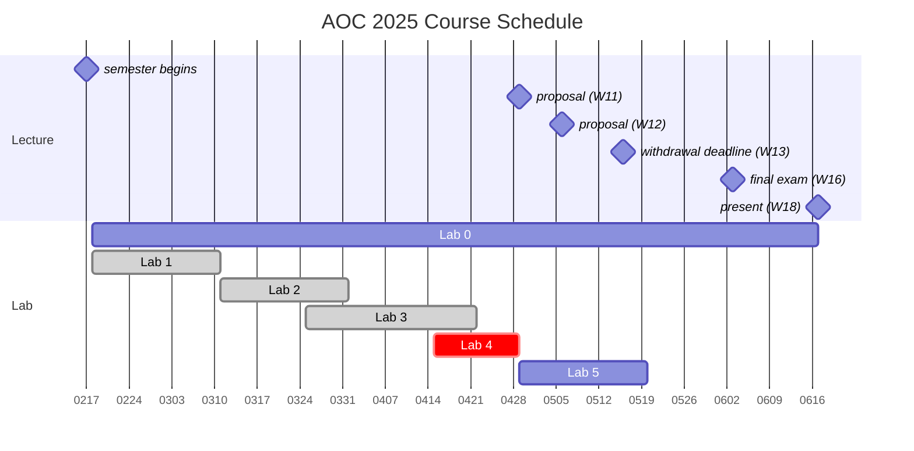

# AOC 2025 Spring Course

## Introduction to AOC Labs

這門課程 **AI on Chip** 主要聚焦於兩大核心目標。首先，學生將學習常見 AI 模型所涉及的運算方式，並具備對模型進行效能分析（profiling）的能力。其次，課程將介紹目前主流的硬體加速設計，幫助學生理解硬體加速的原理。不僅僅是硬體設計本身，還包括如何透過編譯器（compiler）與執行時系統（runtime）的設計，最大化硬體的運行效率。

今年的 AOC Lab 將引導學生將一個 CNN 模型 透過 TVM 部署於自行設計的 Eyeriss-based 加速器上。我們將從軟體到硬體，逐步涵蓋所有關鍵主題，最終串聯成一個完整的系統。透過這門課程，學生將培養以下核心能力：

- AI 模型運算分析
- AI 模型優化與量化
- AI 加速器硬體設計
- 系統軟體架構設計

本年度的 Lab 總計 **六個**，其中 **五個** 會計入成績：

- **Lab 0 - Preliminaries**（不計分）
  檢視學生是否具備 C、Python、RTL 撰寫與 Linux Shell 指令等基本能力，以確保後續 Lab 的順利進行。
- **Lab 1 - AI Model Design and Quantization**
  學習基本的模型訓練與量化技術，為後續硬體設計與部署奠定基礎。
- **Lab 2 - Performance Modeling**
  撰寫 analytical model，對未來設計的硬體進行效能預測。
- **Lab 3 - Hardware Architecture Design**
  依據 Eyeriss 架構實作 PE-array 的 dataflow，外部控制器、DMA、AXI 介面由助教提供。學生需先研讀 Eyeriss 論文。
- **Lab 4 - Runtime and Performance Profiling**
  開發驅動程式（driver）連結軟硬體，並學習在 CPU-only 裝置上進行運算優化。
- **Lab 5 - AI Compiler**：
  使用 TVM 設計客製化 C code-generator，將 ONNX/PyTorch 模型轉換為 C 程式，並與硬體進行 co-simulation。

此外，這次各個 lab 將提供以下學習資源，皆可以在 Moodle 上存取：

- HackMD 線上講義
- HackMD 補充說明與 FAQ（視修課情況滾動式更新）
- 程式碼

透過這門課程，學生將能夠從軟體到硬體，完整掌握 AI 運算與加速的關鍵技術，為未來在 AI 加速領域的進階研究與開發奠定堅實基礎。

## Annoucements

### Server Account Registration

請同學先填寫 [Server Account Registration](https://forms.gle/BK4WEmVALoa7H6q16) 註冊伺服器帳號，帳號建立完成後將以 Email 通知，若超過 24 小時未收到通知，請於 Discord 私訊助教，或寄信至 course.aislab@gmail.com，郵件主旨設為 **[AOC2025] Server Account Registration**，並於信中附上下列資訊，謝謝。

- 姓名
- 學號
- 系級
- Email
- 修課 or 旁聽

 

請修課同學查看自己的信箱（包含垃圾郵件）是否有收到信件，Server Registration 會在每天晚上固定建立及寄信，已填寫註冊表單且過 24 hr 尚未收到信件再寄信至助教信箱確認。另外，Server Registration 僅受理至 2/22（六）23:59，屆時表單將會關閉，請欲修課同學盡快填寫表單。

- 2/17~2/18 填寫表單的修課同學已於 2/19 02:20 左右寄出
- 2/19 填寫表單的修課同學已於 2/20 00:30 左右寄出

由於伺服器運算資源有限，旁聽同學暫不開放註冊伺服器帳號，請自備電腦架設實驗環境，若架設環境有遇到問題請於 Discord 的 lab0-discussion-board 發問

### Joining Discord Channel

若尚未進入 AOC 2025 Spring Discord 群組，請寄信至 course.aislab@gmail.com 反應，主旨設為 **[AOC2025] DC Join Request**，並於內文提供 **姓名、學號**，群組內將會公布課程相關訊息，請同學特別注意。

## Course Schedule & Deadlines

### Lab Homework

|                    | Release   | Deadline                 | Duration  |
| ------------------ | --------- | ------------------------ | --------- |
| Lab 0              | 2/18 Tue. | -                        | 18 weeks  |
| Lab 1              | 2/18 Tue. | 3/10 Mon. 23:59          | 3 weeks   |
| Lab 2              | 3/11 Tue. | ~~3/24~~ 3/31 Mon. 23:59 | 2+1 weeks |
| Lab 3              | 3/25 Tue. | 4/21 Mon. 23:59          | 4 weeks   |
| Lab 4              | 4/15 Tue. | 4/28 Mon. 23:59          | 2 weeks   |
| Lab 5              | 4/29 Tue. | 5/19 Mon. 23:59          | 3 weeks   |

### Final Project

|                    | In-class Presentation |
| ------------------ | --------------------- |
| Midterm Proposal   | 4/29 Tue. 09:00-12:00 |
| Midterm Proposal   | 5/6 Tue. 09:00-12:00  |
| Final Presentation | 6/17 Tue. 09:00-16:00 |

## TA Contact Information
!!! danger "Important"
    Lab 相關問題請使用 Discord 討論區統一詢問，Email 不受理 Lab 相關問題

- Email: course.aislab@gmail.com
- Discord: AOC 2025 Spring (填妥上述 [Server Account Registration](https://forms.gle/BK4WEmVALoa7H6q16) 表單後，助教將透過 Email 寄發邀請連結)

## Hands-on Labs

- [Lab 0 - Working Environment Setup](lab0.md)
- [Lab 1 - AI Model Design and Quantization](lab1.md)
- [Lab 2 - Performance Modeling](lab2.md)
- [Lab 3 - Hardware Architecture Design](lab3.md)
- [Lab 4 - Runtime and Performance Profiling](lab4.md)
- [Lab 5 - AI Compiler](lab5.md)
